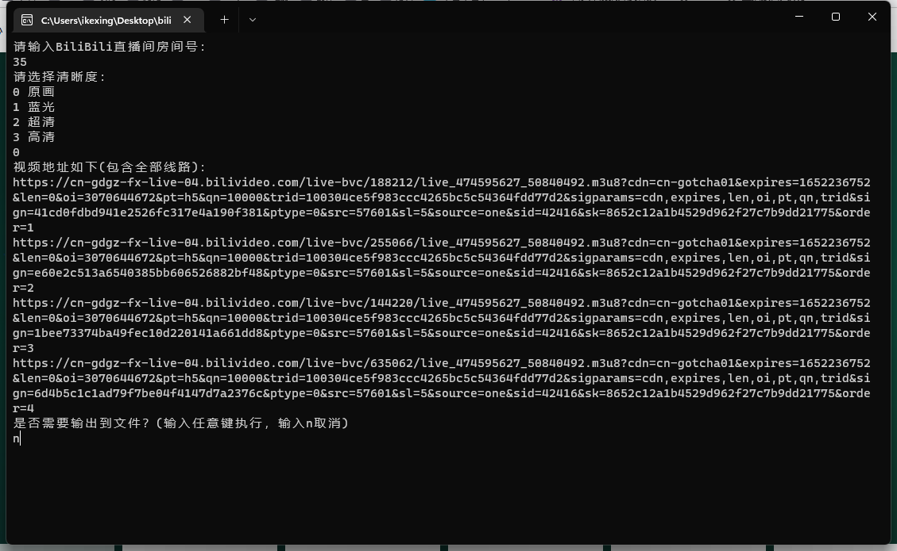
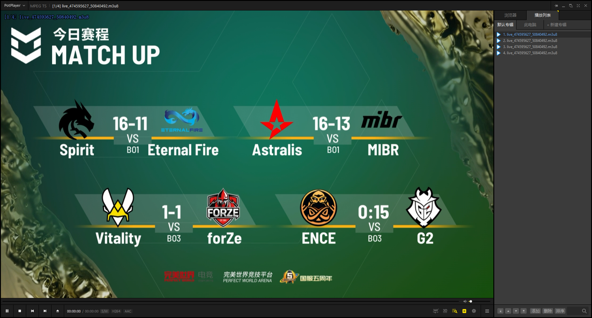

# bilibili-live-stream
## 一个简单地获取bilibili直播流的小工具

# 如何使用
1. 前往 [releases](https://github.com/ikexing-cn/bilibili-live-stream/releases) 查看并下载最新版本
2. 双击运行此软件
3. 按照流程进行操作
4. 将导出的文件复制
5. 打开PotPlayer(以windows为例)：
6. 右键播放器主界面 -> 打开 -> 打开链接 -> 输入刚才复制的全部链接 （ 快捷键： **Ctrl+U** ）
7. 在右侧播放列表中选择直播流
8. 到此为止，你应该就可以正常的在PotPlayer看直播了
9. 如果你有其他问题，请在[Issues](https://github.com/ikexing-cn/bilibili-live-stream/issues)里反馈

> 写在最后：最近major除了B站外都没版权，而b站的纯净流又会自动更新很难和6657对上时间，PotPlayer播放可以暂停就舒服了太多，
> 但一些获取直播流的教程对新手来说又不是很友好，所以我决定写一个小工具，让大家可以轻松获取b站的直播流。
